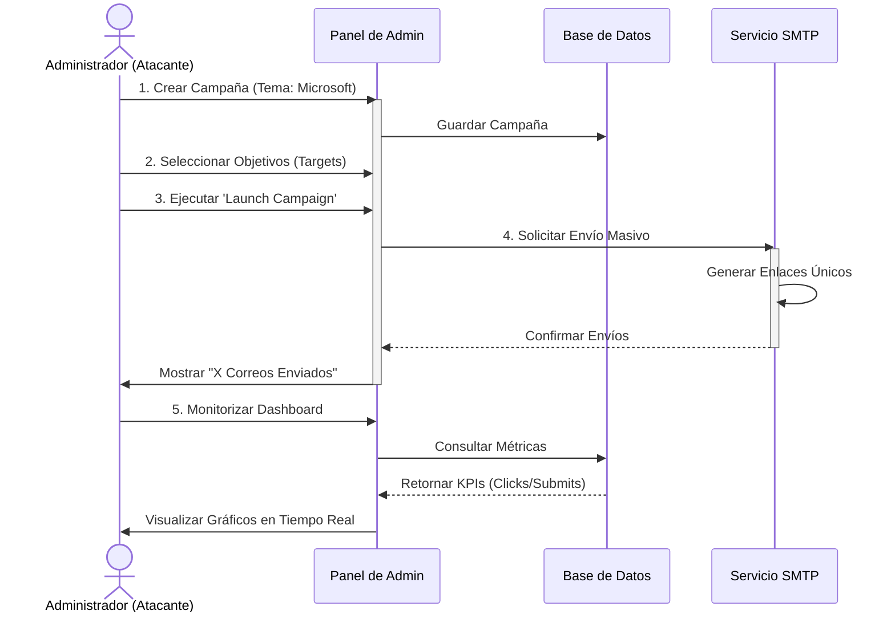
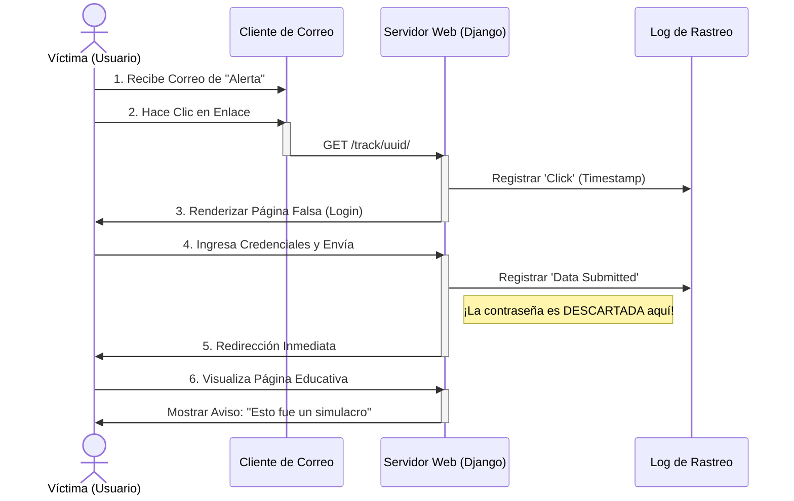

# Ensayo Técnico: Desarrollo de una Plataforma de Simulación de Phishing

**Materia:** Seguridad de la Información  
**Fecha:** 26 de Enero de 2026

> [!WARNING]
> **DESCARGO DE RESPONSABILIDAD LEGAL (DISCLAIMER)**
> Este software ha sido desarrollado con fines estrictamente educativos y de auditoría interna autorizada. Los desarrolladores no se hacen responsables del mal uso de esta herramienta. La suplantación de identidad y el envío de correos fraudulentos sin consentimiento explícito constituyen delitos tipificados en la legislación vigente. Este sistema debe ser ejecutado únicamente en entornos controlados y con la autorización por escrito de todos los participantes.

## 1. Introducción: La Ingeniería Social como Vector de Ataque

En el presente proyecto, el equipo ha desarrollado una plataforma integral para la simulación de ataques de Phishing, motivado por la premisa de que el factor humano sigue siendo el eslabón más débil en la cadena de seguridad de la información. Nuestro objetivo principal no ha sido solo crear una herramienta técnica, sino diseñar un entorno educativo capaz de medir y mejorar la concienciación de seguridad en una organización.

Se aborda específicamente la problemática del *Credential Harvesting* (Cosecha de Credenciales) mediante técnicas de *Brand Spoofing*. En nuestro análisis, identificamos que la confianza ciega de los usuarios en interfaces familiares —como las de Microsoft 365 o Google Workspace— es el vector que los atacantes explotan con mayor éxito. Por ello, construimos este sistema para emular estas amenazas de manera controlada, ética y pedagógica.

## 2. Psicología Social Aplicada a la Ciberseguridad

Más allá del código, la efectividad de nuestra simulación se fundamenta en principios de psicología social. El diseño de las campañas explota sesgos cognitivos específicos para evadir el pensamiento crítico del usuario:

*   **Principio de Autoridad:** Al suplantar entidades reconocidas como Microsoft o Google, aprovechamos la tendencia natural de los usuarios a obedecer solicitudes "oficiales" o administrativas.
*   **Sentido de Urgencia:** Los correos simulan alertas de seguridad críticas (e.g., "Inicio de sesión inusual"), induciendo un estado de ansiedad que precipita la acción impulsiva (clic) antes de la verificación racional.
*   **Sesgo de Hábito:** Al clonar interfaces que el usuario utiliza diariamente, activamos su "piloto automático". La familiaridad visual reduce la carga cognitiva y baja las defensas de sospecha.

## 3. Definición del Escenario y Consideraciones Éticas

El ataque simulado se define como un ejercicio de "Clone Phishing". Para ello, utilizamos copias visualmente idénticas de sitios legítimos con el fin de inducir al usuario al error. Sin embargo, como desarrolladores comprometidos con el hacking ético, implementamos salvaguardas estrictas: el código valida que el usuario intentó enviar datos, pero deliberadamente se descarta cualquier contraseña ingresada antes de que toque la base de datos. De esta manera, garantizamos la privacidad total de los participantes mientras obtenemos las métricas necesarias para el análisis de riesgo.

## 4. Arquitectura y Tecnologías Seleccionadas

Para la construcción de la plataforma, seleccionamos **Django (Python)** como framework backend. Esta elección se fundamenta en su arquitectura MVT (Modelo-Vista-Template), que permite desacoplar la lógica de negocio de la presentación visual, facilitando la escalabilidad del proyecto.

En el frontend, se optó por un enfoque artesanal utilizando **HTML5 y CSS3 puros** para clonar las interfaces de Microsoft y Google, asegurando una fidelidad visual "pixel-perfect" que resulta crucial para el engaño. Para la visualización de datos en el dashboard, integramos la librería **Chart.js**, lo que permite presentar métricas complejas de manera intuitiva y ejecutiva.

Para la infraestructura de comunicaciones, se configuró un **backend SMTP conectado a Gmail**. Decidimos utilizar este proveedor real en lugar de una simulación de consola para enfrentar los desafíos reales de entregabilidad y evasión de filtros de spam básicos, acercando la simulación a un escenario de mundo real.

### 4.1 Estructura del Proyecto
El proyecto sigue una estructura modular de Django, dividiendo responsabilidades claramente:

```
security_awareness_platform/
├── config/              # Configuraciones globales (settings.py, urls.py)
├── simulation/          # Núcleo del ataque
│   ├── models.py        # Modelos (Campaign, Target, TrackingLog)
│   ├── views.py         # Lógica de engaño y captura (track_click, dummy_login)
│   ├── services.py      # Lógica de envío de correos (SMTP)
│   └── templates/       # Páginas clonadas (Google, Microsoft)
├── analytics/           # Motor de reporte
│   ├── views.py         # Cálculo de KPIs y Dashboard
│   └── templates/       # Vistas de gráficos y reportes PDF
└── db.sqlite3           # Base de datos (No almacena passwords)
```
### 4.2 Mapa de Rutas (Endpoints)
La arquitectura de direccionamiento se divide en dos zonas lógicas: la zona de administración (Atacante) y la zona de simulación (Víctima).

**Zona de Administración (Acceso Restringido):**
*   `/admin/` - Panel de Control central. Desde aquí se crean campañas y se lanzan los ataques.
*   `/analytics/dashboard/` - Centro de comando visual. Muestra gráficos y métricas en tiempo real.
*   `/analytics/report/<id>/` - Generador de Informes Ejecutivos en formato imprimible.

**Zona de Simulación (Acceso Público/Víctima):**
*   `/track/<uuid>/` - **El Vector de Ataque.** URL única generada para cada víctima. Al acceder, registra el clic y muestra el *Landing Page* (Microsoft/Google).
*   `/login-submit/<uuid>/` - Endpoint receptor de credenciales. Procesa el formulario POST, cuenta el compromiso y descarta la contraseña.
*   `/education/` - **The Teachable Moment.** Página final de aterrizaje que revela el simulacro.

## 5. Ingeniería Visual: Anatomía del Engaño del Login

La eficacia del phishing moderno reside en la calidad de la clonación. Para este proyecto, no utilizamos generadores automáticos, sino que reconstruimos las interfaces de autenticación "pixel-perfect" utilizando HTML5 y CSS3 nativos. A continuación, detallamos la ingeniería detrás de cada vector:

### 5.1 Vector Microsoft 365 (`landing_microsoft.html`)
Este vector está diseñado para interceptar credenciales corporativas.
*   **Fondo Dinámico:** Implementamos el background oficial de Microsoft (`https://img-prod-cms-rt-microsoft-com...`) mediante hotlinking para asegurar que la imagen de fondo esté siempre actualizada y sea indistinguible de la real.
*   **Caja de Login:** Se replicó el "Card" blanco con sombra suave (`box-shadow: 0 2px 6px rgba(0, 0, 0, 0.2)`).
*   **Tipografía:** Uso forzado de la familia tipográfica `Segoe UI`, exclusiva del ecosistema Windows.
*   **Feedback Visual:** El botón "Siguiente" replica el color azul corporativo `#0067b8` y su estado `:hover` (`#005da6`).

### 5.2 Vector Google Workspace (`landing_google.html`)
Diseñado para comprometer cuentas de acceso a servicios en la nube (Drive, Docs).
*   **Diseño Material:** Se clonaron los principios de Material Design, incluyendo los bordes redondeados de 8px y el diseño centrado de tarjeta única.
*   **Logo Oficial:** Inyección del SVG oficial de Google desde Wikimedia Commons para evitar pixelación en pantallas Retina (`height: 24px`).
*   **Campos Flotantes:** Se imitó el estilo de input de Google con padding amplio (`13px 15px`) y bordes grises suaves (`#dadce0`).
*   **Call to Action:** El botón azul `#1a73e8` con sombra de elevación al pasar el mouse es idéntico al del flujo de autenticación OAuth 2.0 real.

## 6. Desarrollo e Implementación

### 6.1. Orquestación y Automatización de Campañas

Se diseñó el modelo de datos `Campaign` para que actúe como el núcleo de la simulación, soportando múltiples "Temas Visuales". Para facilitar la operación masiva, extendimos el panel de administración de Django implementando una "Acción Personalizada" llamada `launch_campaign`.

Esta función actúa como el disparador del ataque: itera sobre todos los objetivos seleccionados y delega el envío a un servicio de correo especializado, reportando el resultado en tiempo real al administrador.

### 6.2. El Motor de Rastreo (Aperturas)

Uno de los desafíos técnicos principales fue el rastreo individualizado. Implementamos un sistema basado en **UUIDs** (Universally Unique Identifiers), generando un token único para cada par Usuario-Campaña. Cuando la víctima hace clic, nuestra vista `track_click` intercepta la petición, busca el token y registra el evento de apertura.

### 6.3. Simulación de Robo de Credenciales (Compromiso)

Esta es la fase crítica del ataque. Desarrollamos la vista `handle_dummy_login` para procesar el formulario POST que envía la víctima desde la página clonada. Aquí es donde aplicamos el principio ético de **privacidad por diseño**: verificamos que se enviaron datos (confirmando el compromiso de seguridad), actualizamos la bandera `data_submitted = True`, pero jamás leemos ni almacenamos el contenido de los campos de contraseña.

### 6.4. Análisis de Inteligencia y Dashboard

Para transformar los datos crudos en inteligencia accionable, desarrollamos un motor de análisis en `analytics/views.py`. Calculamos dos KPIs fundamentales:
*   **Click Rate ( Tasa de Interés):** Mide la efectividad del "Asunto" del correo y la ingeniería social inicial.
*   **Submit Rate (Tasa de Compromiso):** Mide la efectividad de la página clonada y la falta de concienciación del usuario.

Los resultados se visualizan en un Dashboard interactivo y, adicionalmente, el sistema genera **Informes Ejecutivos imprimibles** (`analytics/report.html`) que clasifican automáticamente el nivel de riesgo de la organización (Bajo, Medio, Alto) basándose en umbrales predefinidos (e.g., >20% de compromiso es Riesgo Alto).

### 6.5. Feedback Educativo Inmediato (Teachable Moment)

Consideramos que una simulación sin educación es inútil. Por ello, programamos el flujo de la aplicación para que, instantáneamente tras el envío de datos, el usuario sea redirigido a una "Página de Educación" (`education.html`).
Esta página transforma el incidente de seguridad en un momento de aprendizaje positivo, explicando:
1.  **Qué ocurrió:** Notificación clara de que fue un simulacro.
2.  **Por qué ocurrió:** Señalización de los indicadores de compromiso ignorados (remitente sospechoso, sentido de urgencia).
3.  **Prevención futura:** Consejos prácticos como verificar la URL antes de hacer clic.

## 7. Modelado de Procesos (Casos de Uso)

Para ilustrar la interacción entre los actores y el sistema, presentamos los siguientes diagramas de secuencia modelados en UML.

### 7.1 Vista del Atacante (Operador del Sistema)
Este flujo describe el ciclo de vida de la operación desde la perspectiva del 'Red Team' o administrador de seguridad. El proceso comienza con la configuración estratégica de la campaña en el panel de control, donde se selecciona la identidad a suplantar (Microsoft, Google, etc.). A continuación, el sistema actúa como un servidor de Comando y Control (C2), orquestando el envío masivo de correos mediante un despachador SMTP asíncrono. Finalmente, el ciclo se cierra con la vigilancia activa: el administrador monitorea en tiempo real quién ha caído en la trampa, permitiendo una evaluación instantánea de la postura de seguridad de la organización sin intervención manual.



### 7.2 Vista de la Víctima (Usuario Final)
Este diagrama ilustra la **"Kill Chain"** desde la perspectiva del usuario final. La experiencia está diseñada para ser indistinguible de un evento real hasta el último momento. El usuario recibe un correo técnicamente legítimo (pasando filtros básicos) que apela a su sentido de urgencia. Al interactuar con el enlace, el sistema registra silenciosamente la huella digital del evento (apertura). El punto crítico ocurre en el envío del formulario: el sistema intercepta las credenciales para validar el compromiso, pero aplica un protocolo de **"Privacidad por Diseño"** para descartarlas inmediatamente, redirigiendo al usuario a una intervención educativa positiva (*Teachable Moment*) que refuerza el aprendizaje mediante la experiencia directa.



## 8. Metodología de Validación

Para garantizar la fiabilidad del sistema antes del despliegue, se ejecutó un protocolo de pruebas de caja blanca:

1.  **Pruebas de Conectividad SMTP:** Se verificó el envío exitoso de correos a buzones externos (Gmail, Outlook) validando que los enlaces generados contuvieran el dominio correcto de la instancia host.
2.  **Validación de Privacidad:** Se realizaron inyecciones de datos sensibles reales en los formularios clonados y se auditó la base de datos (archivo `db.sqlite3`) para certificar que **ninguna contraseña** fuera persistida, confirmando la efectividad de la salvaguarda ética en `handle_dummy_login`.
3.  **Stress Testing del Dashboard:** Se simularon campañas con 50 usuarios concurrentes para verificar que Chart.js renderizara las estadísticas en tiempo real sin latencia perceptible.

## 9. Análisis de Resultados y Evidencias

Presentamos a continuación las evidencias visuales del funcionamiento del sistema, demostrando el ciclo completo del ataque.

*(Espacio reservado para Captura: Lista de Objetivos en Admin)*
> **Figura 1:** Gestión de Objetivos (`Target`) en el panel de administración. Aquí se cargan los correos de las víctimas potenciales.

*(Espacio reservado para Captura: Lista de Campañas)*
> **Figura 2:** Panel de Control de Campañas. Se observa el estado y la fecha de creación de cada ejercicio de simulación.

*(Espacio reservado para Captura: Acción de Lanzamiento)*
> **Figura 3:** Ejecución de la acción personalizada `Launch campaign`. Al seleccionar una campaña y ejecutar esta acción, el sistema dispara los correos masivos.

*(Espacio reservado para Captura: Correo en Gmail)*
> **Figura 4:** Vista de la víctima. El correo de phishing llega a la bandeja de entrada (Gmail) utilizando técnicas de spoofing visual.

*(Espacio reservado para Captura: Landing Page Microsoft)*
> **Figura 5:** Clon de la página de inicio de sesión de Microsoft. Observe la fidelidad visual diseñada para engañar al usuario.

*(Espacio reservado para Captura: Landing Page Google)*
> **Figura 6:** Variante del ataque clonando la interfaz de Google Workspace. Esto demuestra la versatilidad del motor de plantillas.

*(Espacio reservado para Captura: Teachable Moment - Página de Educación)*
> **Figura 7:** Pantalla de educación mostrada inmediatamente después de que el usuario ingresa sus datos. Aquí se revela el simulacro.

*(Espacio reservado para Captura: Dashboard)*
> **Figura 8:** Dashboard analítico en tiempo real. Los gráficos de Chart.js muestran las tasas de apertura vs. compromiso.

*(Espacio reservado para Captura: Informe Ejecutivo)*
> **Figura 9:** Vista de impresión del Informe Ejecutivo generado automáticamente, con clasificación de riesgo alto, medio o bajo.

## 10. Manual de Despliegue

Para replicar este entorno de simulación, se requieren los siguientes pasos técnicos:

1.  **Prerrequisitos:** Python 3.10+ instalado.
2.  **Instalación:** `pip install django`
3.  **Configuración:** Definir `EMAIL_HOST_USER` y `EMAIL_HOST_PASSWORD` en `settings.py`.
4.  **Ejecución:** `python manage.py runserver`

## 11. Limitaciones y Trabajo Futuro

Reconocemos que, aunque funcional, el sistema desarrollado tiene limitaciones:

*   **Entorno de Prototipado:** Actualmente el sistema opera con `DEBUG = True` y base de datos SQLite. Una implementación en producción real requeriría migrar a PostgreSQL y configurar un servidor WSGI con certificados SSL (HTTPS).
*   **Vectores de Ataque:** Depende exclusivamente del correo electrónico, dejando fuera vectores como el SMS (Smishing).
*   **Evasión:** Soluciones de seguridad corporativa avanzadas podrían bloquear nuestros dominios si no se configuran registros SPF/DKIM adecuados.

Como trabajo futuro, el grupo propone la integración con Active Directory para la importación automática de usuarios y el desarrollo de "archivos adjuntos armados" para simular escenarios de malware.

## 12. Conclusión

Concluimos que el desarrollo de esta plataforma valida la hipótesis inicial: la sofisticación técnica no es el único camino para comprometer un sistema; la manipulación psicológica es igualmente efectiva. A través de este proyecto, demostramos que es posible construir herramientas de auditoría potentes y éticas utilizando tecnologías accesibles como Django, permitiendo a las organizaciones fortalecer su postura de seguridad desde la educación y no solo desde la restricción.
